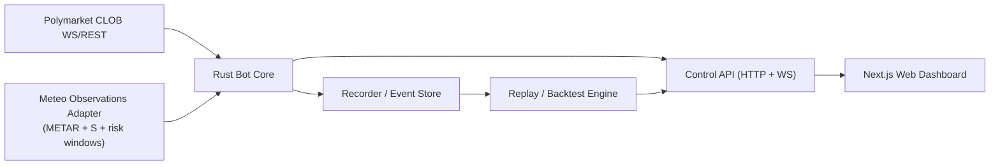

# METEOBOT_ARCH_V0

Version: 1.0 (transfer package)
Date: 2026-02-26
Audience: Arranque del nuevo proyecto `polymeteo-bot`.

## 0. Resumen ejecutivo

Objetivo:
- Construir un sistema profesional de market-making para mercados meteorologicos de Polymarket (buckets discretos de maxima diaria), con prioridad absoluta en simulacion/backtest realista y luego paper/live con riesgo controlado.

Decisiones base:
- Proyecto separado de `meteoTrader`
- `simulation-first`
- bot core en Rust (hot path)
- dashboard web desacoplado (Next.js)
- reglas meteo reutilizadas como moduladores de riesgo, no como motor direccional por defecto

## 1. Alcance y no-alcance (v0)

## 1.1 Alcance v0 (objetivo correcto)
- Recorder de orderbook/trades (CLOB) con persistencia
- Motor de simulacion/replay con mismos componentes del bot (sin exchange real)
- Motor de quoting neutral (2 lados) con inventario y skew
- Risk engine (exposure, kill-switch, ventanas peligrosas)
- Dashboard web para control/monitorizacion/simulacion
- Paper-live (sin enviar ordenes) como paso previo a live

## 1.2 No-alcance v0
- Alpha direccional complejo basado en prediccion meteorologica avanzada
- Multi-exchange arbitrage
- Multi-user SaaS completo
- HFT de microsegundos

## 2. Requisitos de exito (criterios de viabilidad)

## 2.1 Exito de simulacion/backtest
- Replay reproducible de eventos (mismo input -> mismo output)
- Logs equivalentes a los del modo live/paper
- PnL, drawdown, fill-rate y adverse selection medibles por mercado/bucket
- Parametros editables y comparables entre corridas

## 2.2 Exito de paper-live
- Conectado a mercado real (WS/CLOB)
- Sin drift de inventario simulado vs eventos recibidos
- Reconexion robusta WS
- Cancel/requote estable bajo stress
- Telemetria suficiente para post-mortem

## 2.3 Gate para pasar a live (dinero real)
Solo pasar a live si:
- recorder + replay validados
- paper-live estable varios dias
- kill-switch y circuit breakers probados
- latencia y fill-model entendidos
- auditoria de ordenes/cancelaciones completa

## 3. Arquitectura recomendada (v0)



## 3.1 Componentes

### A. `rust-bot-core` (hot path)
Responsabilidades:
- conexion WS a market data
- normalizacion de orderbook events
- quote engine (bid/ask)
- order manager (cancel/replace, batch)
- inventory manager
- risk engine en memoria
- estado por mercado/bucket

Requisitos:
- async (Tokio)
- sin bloqueos en hot path
- estructuras de datos en memoria, allocation-conscious
- trazabilidad estructurada (`tracing`)

### B. `recorder` (puede ser modulo del core al inicio)
Responsabilidades:
- guardar eventos de mercado con timestamps precisos
- snapshots/deltas de orderbook
- trades y fills observados
- eventos del bot (quote, cancel, fill, pause, kill-switch)

Objetivo:
- dataset de replay para backtest realista

### C. `replay/backtest-engine`
Responsabilidades:
- leer dataset grabado
- reproducir flujo temporal (1x, 10x, 50x)
- inyectar eventos al mismo quote/risk/order logic (o el maximo posible)
- calcular metricas (PnL, adverse selection, inventory drift, cycle stats)

Principio clave:
- simulation y live deben compartir logica, cambiar solo la capa de IO/execution.

### D. `control-api`
Responsabilidades:
- exponer estado de mercados/quotes/inventario/PnL
- start/stop/kill-switch
- set de parametros (skew, spread minimo, size, max exposure)
- endpoints de backtest y consultas de resultados
- stream realtime al dashboard (WS/SSE)

### E. `web-dashboard` (Next.js)
Responsabilidades:
- UI operativa (Simulation / Live / Markets / Logs / Settings)
- visualizacion de PnL, inventario, latencia, fills
- configuracion y controles (Start/Stop/Kill)
- no ejecutar logica critica de trading

## 4. Separacion de modos (Simulation vs Live)

## 4.1 Principio de diseno
Los modos deben compartir el maximo codigo posible.

No crear dos bots distintos.

### Capas que cambian
- `MarketDataSource`
  - Live: WS real CLOB
  - Simulation: replay de recorder
- `ExecutionGateway`
  - Live: envia/cancela ordenes reales
  - Paper-live/Simulation: simula fills/acks/cancels
- `Clock`
  - Live: tiempo real
  - Simulation: reloj controlado por replay

## 4.2 Modo Simulation / Backtest (prioridad #1)
Entradas:
- dataset recorder (orderbook + trades + eventos)
- configuracion de estrategia y riesgo
- datos meteo/observacion historicos (si se usan como gating)

Salidas:
- PnL
- drawdown
- fill-rate
- spread capturado
- adverse selection
- tiempos de quote/cancel
- logs exportables (CSV/JSON)

## 4.3 Modo Paper-live
Objetivo:
- ejecutar la misma logica en mercado real sin enviar ordenes reales
- medir real-time behavior y modelo de fills simulado

## 4.4 Modo Live
Objetivo:
- enviar ordenes reales con capital minimo y limites duros
- activar solo tras gates de validacion

## 5. Recorder y datos historicos (riesgo tecnico #1)

## 5.1 Problema real
Un backtest de market-making sin datos de microestructura es facilmente enganoso.

APIs publicas agregadas (Gamma/Data) pueden no ser suficientes para replay fiel del libro.

## 5.2 Recomendacion
Construir recorder propio desde el principio:
- suscripcion WS orderbook por markets/buckets objetivo
- trades y top-of-book (si disponible)
- timestamps locales y de exchange (si existen)
- compresion/rotacion por dia/mercado

## 5.3 Persistencia (v0)
Inicial recomendado:
- SQLite (simple, suficiente para arranque)
- archivos parquet/jsonl para eventos de alto volumen (segun throughput)

Diseñar interfaces para migrar a:
- Postgres / ClickHouse / object storage si crece

## 6. Integracion de meteo en el bot (sin convertirlo en direccional)

## 6.1 Rol de meteo en el bot MM
Meteo no es el alpha principal del bot neutral. Debe usarse para:
- detectar ventanas peligrosas
- reducir size
- ampliar spread
- apagar quoting en mercados casi resueltos por observacion

## 6.2 Datos minimos meteo que el bot necesita
Desde `POLYMETEO_RULES_SPEC.md`:
- `M`, `Δ`, `S`, `observedFloor` truncado
- parseo de condicion y fecha del mercado
- hora local de ciudad
- danger window (reglas de producto + observacion)

## 6.3 Integracion tecnica recomendada (v0)
Opcion A (mas rapida):
- modulo meteo dentro del bot que implemente las reglas minimas (METAR + S + truncado + danger window)

Opcion B (mas limpia si ya existe servicio estable):
- consumir un `Weather Risk Adapter API` desde `polyMeteo`/backend dedicado

Para v0, prefiero A (menos dependencia externa en hot path), dejando puerta abierta a B.

## 7. Motor de quoting y riesgo (baseline v0)

## 7.1 Reglas iniciales (alineadas con tu idea)
- Operar solo si spread bruto y spread neto esperado superan umbrales
- No cruzar spread salvo salida/kill/flatten
- Cotizar ambos lados por defecto (neutral)
- Cancel-before-requote obligatorio
- Skew por inventario neto
- Size dinamico si `|net|` supera umbral
- Off o size minimo en ventanas peligrosas

## 7.2 Riesgos obligatorios (guardrails)
- max exposicion por bucket
- max inventario neto global
- max perdida diaria
- max perdida por mercado
- timeout de ordenes colgadas
- kill-switch manual y automatico
- circuit breaker por latencia/fallo WS

## 7.3 Estado minimo por bucket
- best bid/ask observados
- quotes activos propios (buy/sell)
- inventario neto YES/NO
- exposure notional
- timers de quote/cancel
- ultimo fill / ultimo adverse event

## 8. Seguridad y operacion live

## 8.1 Principio
El bot live debe correr server-side, no en navegador.

## 8.2 Firma y llaves
- No private key en frontend
- Considerar signer local seguro para v0 (env/secret manager), con migracion futura a KMS/HSM
- Separar credenciales de trading de credenciales de dashboard

## 8.3 Control de operaciones
- Endpoint/API de kill-switch con autenticacion fuerte
- Confirmaciones para cambios de riesgo de alto impacto
- Auditoria de quien cambio que y cuando

## 9. Dashboard web (Next.js) - arquitectura funcional

## 9.1 Pestañas objetivo (segun tu idea)
- `Live`
- `Simulation`
- `Markets`
- `Logs`
- `Settings`

## 9.2 Requisitos de UX operativa
- estado del bot muy visible (`RUNNING`, `PAUSED`, `KILL`, `DEGRADED`)
- PnL en vivo
- inventario neto por bucket
- latencia media / p95
- fills, cancel rate, adverse selection flags
- feed de temperatura real y estado de "ventana peligrosa"
- controles claros de Start/Stop/Kill

## 9.3 Realtime UI
- WS o SSE desde `control-api`
- objetivo UX < 200 ms (dashboard), sin exigir latencia de hot path

## 10. Stack tecnico recomendado (v0)

## 10.1 Backend / Bot
- Rust + Tokio
- `polymarket-client-sdk` (WS)
- `alloy` signer (segun integracion real)
- `tracing` + `tracing-subscriber`
- `serde`, `rust_decimal`, `chrono`
- storage v0: SQLite

## 10.2 Dashboard web
- Next.js (App Router) + TypeScript
- Tailwind
- Lightweight Charts / Recharts
- Zustand/Jotai (segun preferencia del equipo)
- `viem` / `wagmi` solo para UX de wallet (no como motor del bot)

## 10.3 DevOps / despliegue v0
- Docker + docker-compose local
- VPS o instancia always-on para live (no hosting que duerma)
- observabilidad minima: logs, healthcheck, metrics

## 11. Roadmap por fases (recomendado)

## Fase 0 - Especificacion + fixtures (muy corta)
Entregables:
- contratos de eventos y estado
- modelo de riesgos inicial
- definicion de ciclo de quote/cancel
- fixtures de mercados meteo y casos de observacion

## Fase 1 - Recorder (imprescindible)
Entregables:
- capturador WS de CLOB
- almacenamiento local
- replayable dataset por mercado/fecha
- verificador de integridad de eventos

## Fase 2 - Simulacion / Backtest MVP
Entregables:
- replay engine
- quote engine neutral
- risk engine basico
- PnL + metricas + export CSV
- UI de simulacion minima

## Fase 3 - Paper-live
Entregables:
- conexion a mercado real
- no envia ordenes
- compara decisiones y fills simulados
- mide latencia y estabilidad

## Fase 4 - Live minimo (capital pequeno)
Entregables:
- ordenes reales
- kill-switch duro
- limites estrictos
- monitoreo y auditoria completos

## Fase 5 - Optimizacion / escalado
Entregables:
- mejoras de fill model
- batching avanzado
- multi-market scheduler
- mejoras de latencia
- alertas/telegram opcional

## 12. Definicion de interfaces (propuesta inicial)

## 12.1 Eventos internos del bot (core)
Tipos minimos:
- `OrderbookUpdate`
- `TradeTick`
- `QuoteDecision`
- `CancelRequested`
- `OrderPosted`
- `OrderAck`
- `Fill`
- `InventoryUpdated`
- `RiskBlocked`
- `KillSwitchTriggered`
- `WeatherRiskUpdated`

Todos con:
- `eventId`
- `timestampUtc`
- `marketId/assetId` (si aplica)
- payload serializable

## 12.2 Estado expuesto al dashboard
- `BotStatus`
- `MarketStatus[]`
- `InventoryStatus[]`
- `RiskStatus`
- `PnLStatus`
- `LatencyStatus`
- `Logs/Audit tail`
- `SimulationRunStatus`

## 13. Testing strategy (bot)

## 13.1 Unit tests
- quoting logic
- skew por inventario
- guardrails y exposure caps
- safety windows
- parsing meteo/mercado reutilizado
- reason codes

## 13.2 Property / fuzz tests (recomendado)
- invariantes de inventario
- no-cotizar fuera de [0,1]
- no generar bid >= ask (salvo estrategia explicita)
- kill-switch deja sistema en estado sin ordenes activas

## 13.3 Integration tests
- replay corto con dataset grabado
- reconexion WS simulada
- cancel-before-requote bajo rafagas
- persistencia + recovery de estado tras restart

## 13.4 Paper-live acceptance
- estabilidad X horas
- sin drift de estado
- sin errores no controlados
- logs suficientes para explicar decisiones

## 14. Riesgos y mitigaciones (registro inicial)

## 14.1 Riesgo: backtest irreal
Mitigacion:
- recorder propio
- replay event-driven
- fill model conservador

## 14.2 Riesgo: adverse selection severa
Mitigacion:
- skew dinamico
- size dinamico
- cancel-before-requote
- ventanas peligrosas
- bot off / widen spread

## 14.3 Riesgo: claves/seguridad
Mitigacion:
- signer server-side
- secretos gestionados fuera del frontend
- auditoria de acciones admin

## 14.4 Riesgo: operacion 24/7 inestable
Mitigacion:
- watchdog + heartbeats
- reconexion y reconciliacion
- persistencia de estado
- kill-switch automatico

## 15. Requisitos de usuario / inputs necesarios para iniciar el proyecto

Para arrancar `polymeteo-bot` sin bloqueo, el usuario deberia proporcionar (o confirmar) esto:
- decision de repo/carpeta (`polymeteo-bot`)
- entorno target de despliegue (VPS/local cloud)
- credenciales CLOB / esquema de firma (para live mas adelante)
- alcance inicial exacto (solo simulation o tambien paper-live en MVP)
- mercados/cities iniciales a soportar (las 14 o subset)

## 16. Estructura de repo sugerida (v0)

```text
polymeteo-bot/
  docs/
    BOT_ARCH_V0.md
    RULES_IMPORT_FROM_POLYMETEO.md
    RISK_POLICY.md
  rust-bot/
    Cargo.toml
    src/
      main.rs
      config/
      market_data/
      recorder/
      replay/
      strategy/
      risk/
      orders/
      inventory/
      meteo_adapter/
      api/
      metrics/
      storage/
  web-dashboard/
    package.json
    src/
    app/
    components/
    lib/
  infra/
    docker-compose.yml
    env/
  fixtures/
    markets/
    weather/
    recorder_samples/
```

## 17. Primer milestone tecnico recomendado (muy concreto)

Milestone M1 (2-5 dias de trabajo efectivo):
- crear repo `polymeteo-bot`
- levantar `rust-bot` que:
  - conecta WS (mercado/s de prueba)
  - imprime top-of-book normalizado
  - persiste eventos basicos en SQLite/JSONL
- crear `control-api` con `/healthz`
- crear dashboard minimo que muestre:
  - bot conectado o no
  - top-of-book
  - contador de eventos

Criterio de exito M1:
- recorder funcionando y datos persistidos, base real para Fase 2.

## 18. Instruccion final para el nuevo thread/equipo

Antes de escribir el quote engine live:
1. implementar recorder
2. validar replay
3. portar reglas meteo de `POLYMETEO_RULES_SPEC.md`
4. definir kill-switch y guardrails como componentes de primer orden

No saltarse simulation-first.
Ese atajo suele costar dinero real.

